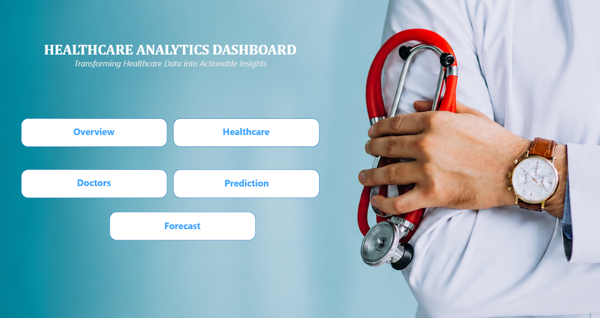
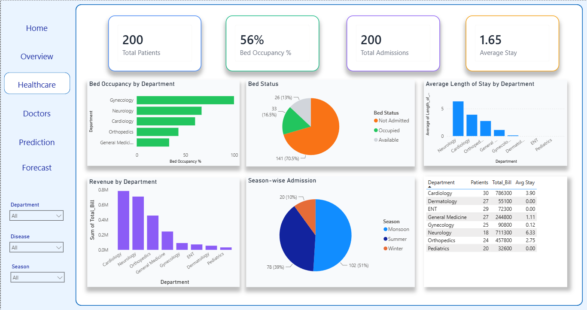
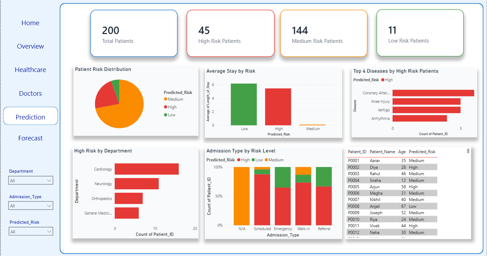
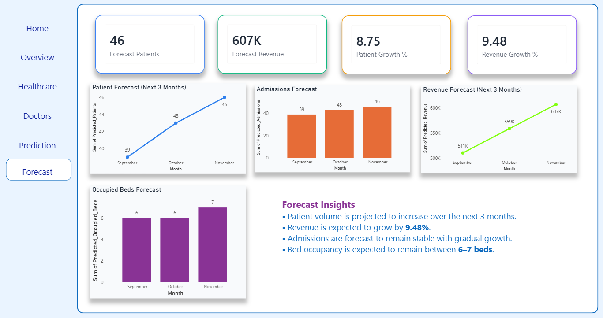

# Hospital Management Analytics Dashboard

## Project Overview

This project presents an interactive **Hospital Management Analytics Dashboard** developed using **Microsoft Excel, Power BI, DAX, and Machine Learning** to analyze hospital operations, patient activity, doctor performance, revenue, bed utilization, patient risk, and future trends.

The dashboard transforms raw healthcare data into meaningful and actionable insights through interactive visualizations, predictive analytics, and forecasting. It helps stakeholders monitor key performance indicators, identify operational trends, optimize resources, and support data-driven decision-making.

---

## Dashboard Pages

### 🏠 Home

The Home page provides an interactive navigation interface for accessing the different sections of the Hospital Management Analytics Dashboard.

**Available Pages:**

* Overview
* Healthcare
* Doctors
* Prediction
* Forecast

---

### 📈 Overview

.png)

The Overview page provides a high-level summary of overall hospital performance.

**KPIs**

* Total Patients
* Total Revenue
* Total Doctors
* Total Admissions

**Visualizations**

* Monthly Patient Trend
* Patient Type Distribution
* Monthly Revenue Trend
* Department-wise Patient Analysis
* Patient Distribution by Gender
* Bed Type Distribution

---

### 🏥 Healthcare Analysis

The Healthcare page focuses on hospital operations, patient admissions, bed utilization, department performance, and length of stay.

**KPIs**

* Total Patients
* Bed Occupancy
* Total Admissions
* Average Length of Stay

**Visualizations**

* Bed Occupancy by Department
* Bed Status Distribution
* Average Length of Stay by Department
* Revenue by Department
* Seasonal Admissions
* Department Performance Analysis

---

### 👨‍⚕️ Doctors Analysis

.png)

The Doctors page evaluates doctor performance based on patient volume, revenue contribution, ratings, and consultation fees.

**KPIs**

* Total Doctors
* Total Patients
* Average Rating
* Average Consultation Fee

**Visualizations**

* Top Doctors by Patients Treated
* Top Doctors by Revenue
* Top Rated Doctors
* Average Rating by Department
* Doctor Performance Analysis
* Consultation Fee by Department

---

### 🤖 Patient Risk Prediction

The Prediction page uses **Machine Learning-based analysis** to classify patients according to their predicted risk levels.

**KPIs**

* Total Patients
* High Risk Patients
* Medium Risk Patients
* Low Risk Patients

**Visualizations**

* Patient Risk Distribution
* Average Stay by Risk Level
* Top Diseases Among High-Risk Patients
* High-Risk Patients by Department
* Admission Type by Risk Level
* Patient Risk Details

---

### 🔮 Forecast

The Forecast page provides a forward-looking analysis of expected hospital performance over the next three months.

**KPIs**

* Forecast Patients
* Forecast Revenue
* Patient Growth
* Revenue Growth

**Visualizations**

* Patient Forecast
* Admissions Forecast
* Revenue Forecast
* Occupied Beds Forecast

---

##  Dashboard Features

* Interactive multi-page navigation
* Dynamic filters and slicers
* Executive KPI cards
* Patient and admission analysis
* Department-wise performance analysis
* Doctor performance analysis
* Revenue analysis
* Bed occupancy monitoring
* Patient risk prediction using Machine Learning
* 3-month forecasting
* Interactive charts and tables
* Clean and business-focused dashboard design

---

## Tools & Technologies

* **Microsoft Excel** – Data cleaning and preparation
* **Power Query** – Data transformation
* **Power BI** – Dashboard development and data visualization
* **DAX** – Calculated measures and KPI development
* **Machine Learning** – Patient risk prediction
* **Forecasting** – Future patient, admission, revenue, and bed occupancy analysis

---

## Key Insights

* Patient and admission trends provide a clear view of overall hospital activity.
* Department-wise analysis helps identify high-performing departments based on patient volume and revenue.
* Bed occupancy monitoring supports efficient hospital resource and capacity management.
* Doctor performance analysis highlights differences in patients treated, revenue contribution, consultation fees, and ratings.
* Machine Learning-based analysis categorizes patients into **High, Medium, and Low Risk** groups.
* High-risk patient analysis helps identify departments and disease categories that may require greater attention.
* Forecasting provides insights into expected patient volume, admissions, revenue, and bed occupancy over the next three months.
* Interactive filters allow users to explore hospital performance from different perspectives and support data-driven decision-making.

---

## Author

### **Archana**

**Data Analyst | Excel | SQL | Python | Power BI**

Passionate about building interactive dashboards and transforming data into actionable insights.

🔗 **LinkedIn:** [www.linkedin.com/in/archana-ramesh-](http://www.linkedin.com/in/archana-ramesh-)
